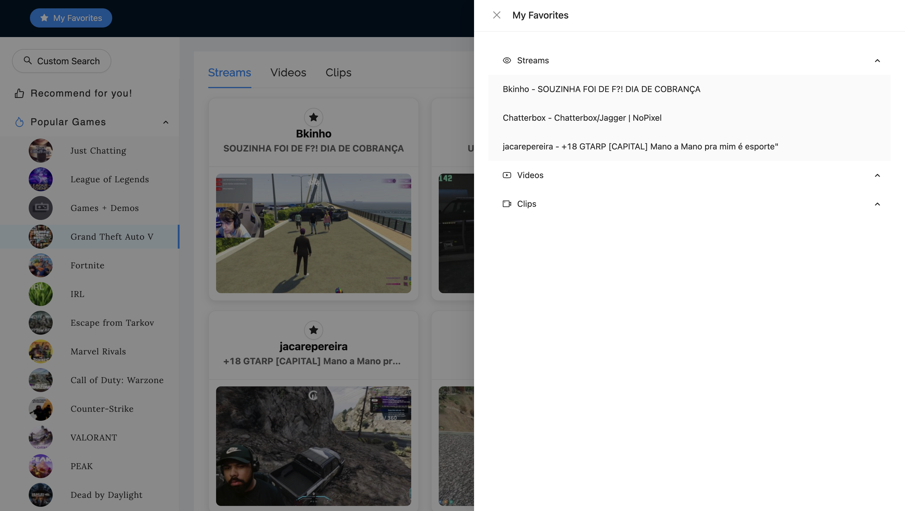

# Twitch+: A Personalized Twitch Resources Recommendation Engine

**Twitch+** is a full-stack web application that allows users to search and explore real-time Twitch content — including **live streams, clips, and videos** — and receive personalized recommendations based on users' favorite items.

<div align="center">
  
  
  
  
</div>

---

## 🌟 Features

- **Search Twitch Content**: Browse live streams, videos, and clips by game.
- **Favorite System**: Mark items as favorites to influence future recommendations.
- **Personalized Recommendation**: Get content-based suggestions based on user behavior.
- **Realtime Integration**: Retrieve live Twitch data using OpenFeign HTTP client.
- **Caching**: In-memory caching with Caffeine for fast and efficient response time.
- **Unit Test**: Key service logic covered by JUnit and Mockito tests.
- **Cloud-Hosted**: Fully deployed on AWS APP Runner using Docker containers.

---

## 🖼️ Tech Stack

| Layer       | Technology                              |
|-------------|-----------------------------------------|
| Frontend    | React, Ant Design, Axios                |
| Backend     | Spring Boot, Spring Security, OpenFeign |
| Database    | MySQL (Amazon RDS)                      |
| Caching     | Caffeine                                |
| Deployment  | Docker, AWS App Runner                  |
| Testing     | JUnit 5, Mockito                        |
| Other       | Gradle                                  |

---

## 🚀 Getting Started

Follow the steps below to run the project locally.

### Prerequisites

Make sure you have the following installed:

- ✅ **Java 17+**
- ✅ **Node.js 18+**
- ✅ **MySQL 8+**
- ✅ **Twitch Developer Credentials** (`client_id`, `client_secret`)

Register your app at [Twitch Developer Console](https://dev.twitch.tv/)

---

### Backend Setup (Spring Boot)

```bash
cd twitch
```

#### 1. Add your Twitch credentials in `src/main/resources/application.yml` under **spring.security.oauth2.client.registration.twitch**:

🔐 **Do not commit this file to version control.**  
In production, use environment variables or secret managers.

Example:

```yaml
spring:
  security:
    oauth2:
      client:
        registration:
          twitch:
            client-id: YOUR_CLIENT_ID
            client-secret: YOUR_CLIENT_SECRET
```

#### 2. Setup database credentials via environment variables:

⚠️ **DO NOT** hardcode DB credentials in `application.yml`.

```yaml
spring:
  datasource:
    url: jdbc:mysql://${DATABASE_URL:localhost}:${DATABASE_PORT:3306}/twitch?createDatabaseIfNotExist=true
    username: ${DATABASE_USERNAME}
    password: ${DATABASE_PASSWORD}
```

---

### Frontend Setup (React)

```bash
cd twitchfe
```

#### 1. Install dependencies

```bash
npm install
```

#### 2. Start the React app

```bash
npm start
```

---

## 📡 Twitch APIs Used

This project uses the following Twitch Helix API endpoints:

```markdown
| Method | Endpoint             | Purpose                                 |
|--------|----------------------|-----------------------------------------|
| GET    | /helix/games/top     | Get top games                           |
| GET    | /helix/games         | Get game details                        |
| GET    | /helix/streams       | Get live streams by game ID             |
| GET    | /helix/videos        | Get videos by game ID                   |
| GET    | /helix/clips         | Get clips by game ID                    |
| POST   | /oauth2/token        | Get access token (client credentials)   |
```

---

## ☁️ Deployment (AWS ECR & AWS App Runner)

### 1. Build Docker Image Locally

Run from the backend root and replace `{repository_base_uri}` with your ECR URI:

```bash
./gradlew bootBuildImage --imageName={repository_base_uri}/twitch
```

### 2. Authenticate with AWS ECR

```bash
aws ecr get-login-password --region {aws_region} | docker login --username AWS --password-stdin {repository_base_uri}
```

### 3. Push Image

```bash
docker push {repository_base_uri}/twitch:latest
```

### 4. Deploy to App Runner

- Source: AWS ECR (the pushed image)
- Add environment variables:
    - `DATABASE_URL`, `DATABASE_USERNAME`, `DATABASE_PASSWORD`
    - `TWITCH_CLIENT_ID`, `TWITCH_CLIENT_SECRET`

---

## 🧪 Testing

JUnit + Mockito are used for unit testing.

Run all tests:

```bash
./gradlew test
```

---

## 🔐 Security

- JWT-based login and logout
- `/login`, `/register`, and selected public endpoints are exposed
- Role-based access control can be extended in `SecurityFilterChain`

---

## 📷 Screenshots
### Home Page


### Search Twitch Content


### Register Page


### Login Page


### After Login Page


### Favorite Page


### Recommendation Page


---
## 🛠️ Planned Features / Improvements
Here are some ideas and planned improvements for future versions:

- [ ] Default placeholder image for games missing `box_art_url`
- [ ] Integrate Python ML microservice for hybrid recommendation
- [ ] Game detail page: Show richer metadata (e.g. viewer count, genres, description)


